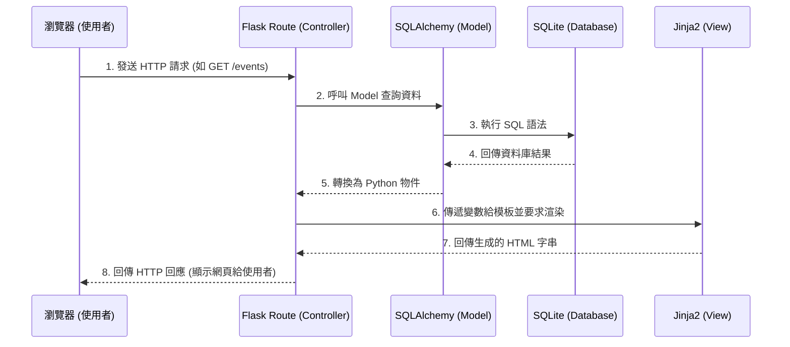

# 系統架構文件 (Architecture) - 活動報名系統

## 1. 技術架構說明

本專案採用的技術堆疊如下：
- **後端框架**：Python + Flask。輕量級且富有彈性，非常適合快速開發與中小型專案。
- **模板引擎**：Jinja2。直接整合在 Flask 中，負責處理 HTML 的動態內容渲染。
- **資料庫**：SQLite 搭配 Flask-SQLAlchemy。不需要額外架設資料庫伺服器，資料儲存在本地檔案中，方便開發與管理。
- **前端呈現**：原生 HTML, CSS, JavaScript 搭配 Jinja2，由後端直接渲染視圖（Server-Side Rendering），不採取前後端分離模式以簡化架構。

### MVC 設計模式 (Model-View-Controller)
本系統將依照 MVC 軟體架構模式進行職責分離：
- **Model (模型)**：定義資料結構及資料庫互動邏輯（例如：活動 `Event`、報名資料 `Registration`）。
- **View (視圖)**：負責呈現使用者介面，這裡為 Jinja2 模板，接收資料並渲染成最終的 HTML 頁面。
- **Controller (控制器)**：由 Flask 的路由（Routes）擔任，負責接收使用者的請求，操作對應的 Model 處理資料邏輯，並將結果傳遞給 View 進行渲染。

## 2. 專案資料夾結構

以下為專案的資料夾與檔案結構規劃：

```text
web_app_development2/
├── app/                        # 應用程式核心目錄
│   ├── __init__.py             # 應用程式工廠與初始化設定
│   ├── models/                 # Model 層：資料庫模型定義
│   │   ├── __init__.py
│   │   ├── event.py            # 活動資料模型
│   │   └── registration.py     # 報名資料模型
│   ├── routes/                 # Controller 層：路由與業務邏輯
│   │   ├── __init__.py
│   │   ├── main_routes.py      # 前台路由 (活動列表、活動說明、報名)
│   │   └── admin_routes.py     # 後台管理路由 (建立活動、修改內容、檢視名單)
│   ├── templates/              # View 層：Jinja2 HTML 模板
│   │   ├── base.html           # 共用頁面版型 (Header, Footer 等)
│   │   ├── index.html          # 前台首頁
│   │   ├── event_detail.html   # 活動詳細說明與報名表單頁面
│   │   └── admin/              # 後台管理頁面
│   │       ├── dashboard.html  # 管理總覽 (統計人數)
│   │       ├── event_form.html # 建立/編輯活動表單
│   │       └── participants.html # 確認報名人員名單
│   └── static/                 # 靜態資源檔案
│       ├── css/
│       │   └── style.css       # 全站樣式表
│       ├── js/
│       │   └── main.js         # 前端腳本
│       └── images/             # 圖片資源
├── instance/                   # 存放本地狀態與資料 (通常不進入版控)
│   └── database.db             # SQLite 資料庫檔案
├── docs/                       # 專案文件
│   ├── PRD.md                  # 產品需求文件
│   └── ARCHITECTURE.md         # 系統架構文件（本文件）
├── requirements.txt            # Python 套件依賴清單
└── run.py                      # 系統啟動入口檔案
```

## 3. 元件關係圖

以下展示瀏覽器、Flask 路由、資料庫與模板引擎間的資料流與互動流程：



## 4. 關鍵設計決策

1. **採用 Server-Side Rendering (SSR)**
   - **原因**：為了快速交付 MVP，使用 Flask 搭配 Jinja2 進行後端渲染，免去架設與維護分離的 RESTful API 與前端框架（如 React/Vue）的時間成本，架構較為單純。
2. **使用 SQLite 作為儲存方案**
   - **原因**：初期報名系統的資料量及併發要求不高，SQLite 以單一檔案形式儲存，不需額外安裝與維護資料庫伺服器，極大化降低了初期建置的門檻。
3. **ORM 採用 Flask-SQLAlchemy**
   - **原因**：將關聯式資料庫對應成 Python 的物件（Class），讓開發者能用物件導向的方式操作資料，提升開發效率。同時 ORM 內建了參數化查詢，可有效防止 SQL Injection 攻擊。
4. **前後台路由分離**
   - **原因**：將 `main_routes.py`（參與者瀏覽與報名）與 `admin_routes.py`（計畫經理人管理）明確區分。這能確保管理後台邏輯的獨立性，未來也方便於 `admin_routes` 統一套用權限檢查與登入驗證，防止一般使用者越權存取報名名單與活動設定。
