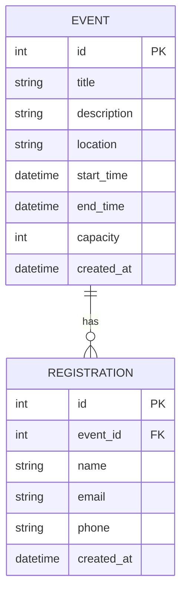

# 資料庫設計文件 (DB Design) - 活動報名系統

根據 PRD 與系統架構文件，本專案採用 SQLite 資料庫搭配 SQLAlchemy ORM。以下為實體關係圖 (ER 圖) 及各資料表的詳細欄位定義。

## 1. ER 圖 (實體關係圖)

本系統主要包含兩個實體：「活動 (Event)」與「報名 (Registration)」。
一個活動可以有多筆報名記錄，因此為「一對多 (One-to-Many)」的關係。

## 2. 資料表詳細說明

### 2.1 Event (活動)

負責儲存計畫經理人建立的活動基本資訊。

| 欄位名稱 | 型別 | 必填 | 說明 |
| :--- | :--- | :---: | :--- |
| `id` | INTEGER | 是 | Primary Key，系統自動遞增 |
| `title` | VARCHAR(100) | 是 | 活動名稱 / 標題 |
| `description` | TEXT | 是 | 活動詳細說明、議程等 |
| `location` | VARCHAR(255) | 是 | 活動舉辦地點 |
| `start_time` | DATETIME | 是 | 活動開始時間 |
| `end_time` | DATETIME | 是 | 活動結束時間 |
| `capacity` | INTEGER | 否 | 活動人數上限（若無上限則為 NULL） |
| `created_at` | DATETIME | 是 | 建立時間 |

### 2.2 Registration (報名)

負責儲存一般參與者針對特定活動送出的報名聯絡資料。

| 欄位名稱 | 型別 | 必填 | 說明 |
| :--- | :--- | :---: | :--- |
| `id` | INTEGER | 是 | Primary Key，系統自動遞增 |
| `event_id` | INTEGER | 是 | Foreign Key，對應 `event.id` |
| `name` | VARCHAR(50) | 是 | 報名者真實姓名 |
| `email` | VARCHAR(120) | 是 | 報名者聯絡信箱 |
| `phone` | VARCHAR(20) | 是 | 報名者聯絡電話 |
| `created_at` | DATETIME | 是 | 報名送出時間 |

## 3. SQL 建表語法

除了使用 SQLAlchemy ORM，我們同時也產出原始的 SQLite 建表語法，存放於 `database/schema.sql` 供參考。

## 4. Python Model 程式碼

根據上述設計，我們將建立 Flask-SQLAlchemy 格式的 Models：
- `app/models/event.py`
- `app/models/registration.py`

並且在這些 Model 中封裝了 CRUD (新增、查詢、更新、刪除) 的方法。
