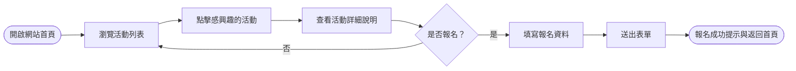
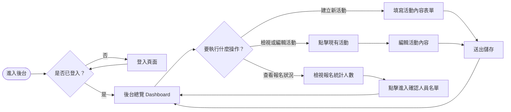
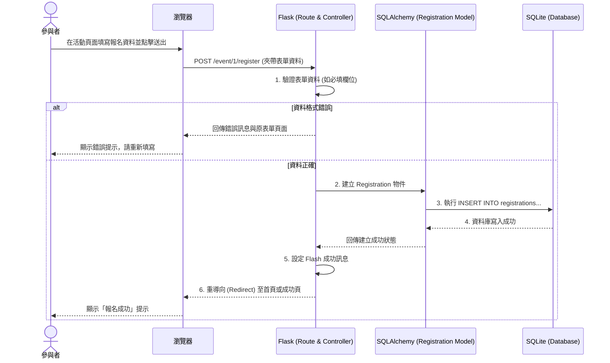

# 流程圖與路由設計 (Flowchart) - 活動報名系統

根據產品需求文件 (PRD) 與系統架構文件 (Architecture)，以下規劃了使用者操作流程、系統運作序列，以及功能與路由的對照表。

## 1. 使用者流程圖 (User Flow)

本系統有兩種主要使用者：「一般參與者」與「計畫經理人（管理員）」。

### 一般參與者流程

### 計畫經理人 (管理員) 流程

## 2. 系統序列圖 (Sequence Diagram)

以下以 **「參與者提交活動報名」** 的情境為例，說明從瀏覽器發出請求到資料存入 SQLite 的完整運作流程。

## 3. 功能與路由對照表 (Route Map)

以下列出所有 PRD 提到的核心功能，以及對應的 URL 路徑與 HTTP 方法。

### 前台 (一般參與者)

| 功能說明 | HTTP 方法 | URL 路徑 | 負責的 View/Controller |
| :--- | :---: | :--- | :--- |
| 首頁 (活動列表) | `GET` | `/` | `main_routes.index` |
| 檢視活動詳細說明 | `GET` | `/event/<id>` | `main_routes.event_detail` |
| 送出報名資料 | `POST` | `/event/<id>/register` | `main_routes.register_event` |

### 後台 (計畫經理人)

| 功能說明 | HTTP 方法 | URL 路徑 | 負責的 View/Controller |
| :--- | :---: | :--- | :--- |
| 後台總覽 (含統計人數) | `GET` | `/admin` | `admin_routes.dashboard` |
| 建立活動表單頁面 | `GET` | `/admin/event/new` | `admin_routes.create_event` |
| 送出建立活動 | `POST` | `/admin/event/new` | `admin_routes.create_event` |
| 編輯活動表單頁面 | `GET` | `/admin/event/<id>/edit` | `admin_routes.edit_event` |
| 送出編輯活動 | `POST` | `/admin/event/<id>/edit` | `admin_routes.edit_event` |
| 刪除/下架活動 | `POST` | `/admin/event/<id>/delete` | `admin_routes.delete_event` |
| 確認報名人員名單 | `GET` | `/admin/event/<id>/participants`| `admin_routes.participants_list` |

> **備註**：所有的 `/admin` 路由未來都應加上 `@login_required` 裝飾器來保護後台安全。
